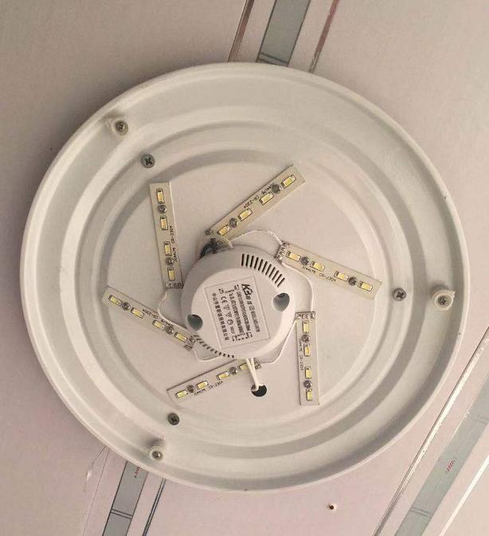
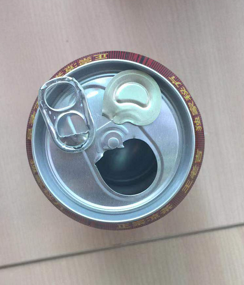
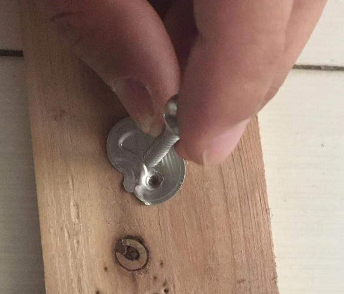
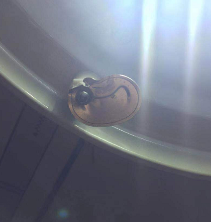
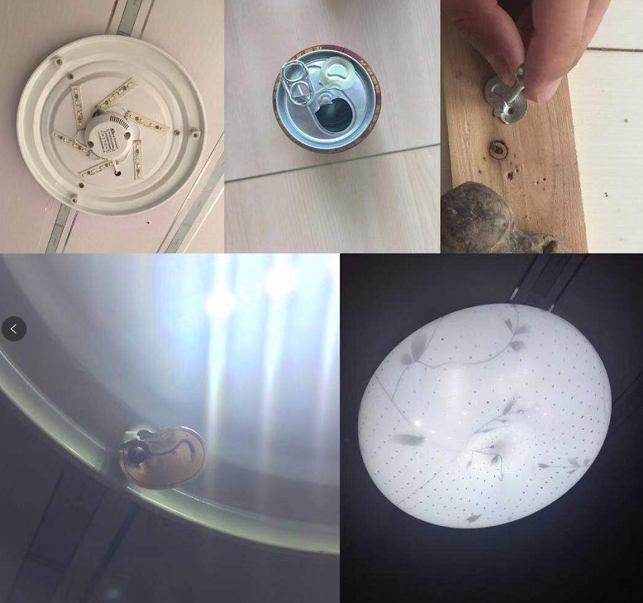

title: 今天早上修了一个灯
author: 洛克
tags:
  - 动动手
categories:
  - 生活
date: 2019-07-31 22:22:00
---
# 今天早上修了一个灯
前天夜里，突然一声响动，查看一番，才知道，厕所的灯罩调了，原来是多年的老化，灯罩的卡头坏。

要不要买个新灯呢，一看地上的灯罩，还是完好的，这样，还是修修吧。

## 今天早上，开始修灯了
- 第一步，要找一个等替代原来的卡片。

- 找了以前的一些螺丝，发现不太匹配

- 想起来了，可以用一个小垫片就可以了

- 阳台有好多的啤酒易拉罐呢，将拉环取下来，看着正合适。

- 打个眼，用来上螺丝

- 安装，上螺丝

- ok了