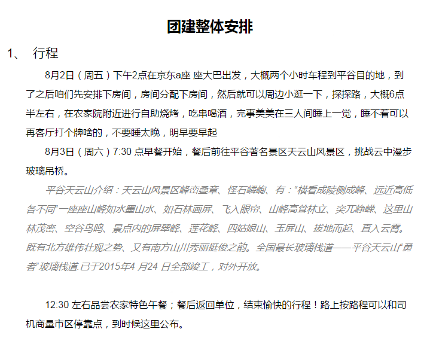

title: 团建出行计划
author: 洛克
tags:
  - 出行
categories:
  - 生活
date: 2019-08-01 12:27:00
---

- 行程8月2日（周五）
下午2点在京东a座 座大巴出发，大概两个小时车程到平谷目的地，到了之后咱们先安排下房间，房间分配下房间，然后就可以周边小逛一下，探探路

- 大概6点半左右，在农家院附近进行自助烧烤，吃串喝酒，完事美美在三人间睡上一觉，睡不着可以再客厅打个牌啥的，不要睡太晚

- 明早要早起8月3日（周六）7:30 点早餐开始，餐后前往平谷著名景区天云山风景区，挑战云中漫步玻璃吊桥。平谷天云山介绍：天云山风景区峰峦叠章、怪石嶙峋、有：“横看成陵侧成峰、远近高低各不同”一座座山峰如水墨山水、如石林画屏、飞入眼帘、山峰高耸林立、突兀峥嵘、这里山林茂密、空谷鸟鸣、景点内的屏翠峰、莲花峰、四姑娘山、玉屏山、拔地而起、直入云霄。既有北方雄伟壮观之势、又有南方山川秀丽挺俊之韵。全国最长玻璃栈道——平谷天云山“勇者”玻璃栈道.已于2015年4 月24 日全部竣工，对外开放。

- 12:30 左右品尝农家特色午餐；餐后返回单位，结束愉快的行程！路上按路程可以和司机商量市区停靠点，到时候这里公布。

- 房间分配​​需带物品身份证，遮阳伞 ，蚊虫药，洗漱用品，充电宝，帽子 防晒霜，自拍杆，穿运动鞋